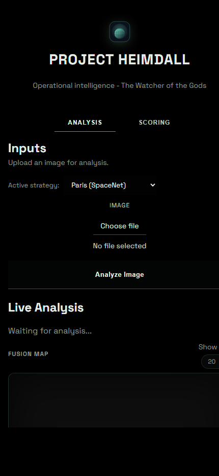

# Project Heimdall

[](#requirements)
[](#requirements)
[](https://github.com/zensakkour/Project-Heimdall/actions/workflows/ci.yml)
[](LICENSE)

Geospatial perception and analysis platform that combines object detection, geo-candidate retrieval, probabilistic fusion, and operator-facing explainability.

## What The Platform Does

Project Heimdall processes image or video inputs and produces:

- Object detections (including oriented bounding boxes for aerial imagery)
- Ranked geolocation candidates
- Fused geolocation estimate with uncertainty metrics
- Operator-friendly analysis views in a local dashboard

## Screenshots

### Analysis UI (Desktop)


### Analysis UI (Mobile)



## Architecture Overview

The platform is organized as a modular pipeline:

1. Detection: runs detector backends through a unified interface.
2. Geo candidate retrieval: proposes top-N location hypotheses.
3. Verification and fusion: combines retrieval + verification signals into posterior weights.
4. Scoring and serialization: emits structured outputs for CLI, batch runs, and UI.
5. Dashboard/API layer: serves analysis and evaluation workflows.

## Technology Stack

- Language: Python 3.10+
- API/UI server: FastAPI + Uvicorn
- Vision and detection: Ultralytics (YOLO OBB), OpenCV, Pillow
- Geolocation: GeoCLIP/GeoSpot-style providers + retrieval index pipeline
- Data tooling: NumPy, Rasterio, AWS CLI integrations
- Validation/testing: JSON Schema, pytest
- Frontend: Vanilla HTML/CSS/JS + MapLibre GL

## Repository Structure

```text
Project-Heimdall/
|- src/
|  |- core/          # Detection, geo, fusion, scoring logic
|  |- tools/         # Data prep, evaluation, utility scripts
|  |- dashboard/     # Analysis UI assets
|  |- schemas/       # Typed payload schemas
|  |- tests/         # Unit tests
|  |- config/        # Runtime config profiles
|  |- docs/          # Technical documentation
|  `- scripts/       # Helper shell scripts
|- data/             # Local datasets/models (not versioned)
|- runs/             # Evaluation outputs
|- docs/images/      # README screenshots
|- README.md
`- requirements.txt
```

## Requirements

- Python 3.10+
- Git
- Optional GPU acceleration: PyTorch installed for your CUDA target

Install project dependencies:

```powershell
python -m venv .venv
.\.venv\Scripts\Activate.ps1
pip install -r requirements.txt
```

## Quick Start

### 1. Generate dashboard summary data

```powershell
.\.venv\Scripts\python -m src.tools.generate_ui_data --jsonl runs/results.jsonl
```

### 2. Start the analysis server

```powershell
.\.venv\Scripts\python -m uvicorn src.tools.ui_server:app --reload --port 8000
```

### 3. Open the app

- `http://127.0.0.1:8000/`
- `http://127.0.0.1:8000/analysis/`

## Common Workflows

### Run single-image inference (CLI)

```powershell
.\.venv\Scripts\python -m src.cli data/samples/real_port_miami.jpg --json
```

### Run batch inference

```powershell
.\.venv\Scripts\python -m src.batch_run data/university-1652/images/train --output runs/results.jsonl
```

### Rebuild dashboard payload from batch output

```powershell
.\.venv\Scripts\python -m src.tools.generate_ui_data --jsonl runs/results.jsonl
```

### Run test suite

```powershell
.\.venv\Scripts\python -m pytest -q
```

## Config Profiles

Config files are under `src/config/`:

- `defaults.json`: default runtime profile
- `paris.json`: SpaceNet Paris-focused profile
- `paris_test.json`: Paris test profile
- `open_geo.json`: lightweight open-geo profile

Pass a config where supported with `--config <path>`.

## Data and Model Notes

- Large datasets and model artifacts are intentionally not stored in Git.
- Typical local paths include:
  - `data/geo_index/*.npz`
  - `data/models/*`
  - `data/dota_v1/*`
- See [Geo Tech Notes](src/docs/GEO_TECH.md) for deeper implementation and dataset details.

## Engineering and Contribution

- Contribution guide: [CONTRIBUTING.md](CONTRIBUTING.md)
- Code of conduct: [CODE_OF_CONDUCT.md](CODE_OF_CONDUCT.md)
- Security policy: [SECURITY.md](SECURITY.md)
- Support: [SUPPORT.md](SUPPORT.md)
- Changelog: [CHANGELOG.md](CHANGELOG.md)
- Progress tracking: [PROGRESS.md](PROGRESS.md)
- Issue templates: [`.github/ISSUE_TEMPLATE`](.github/ISSUE_TEMPLATE)
- PR template: [`.github/pull_request_template.md`](.github/pull_request_template.md)
- CI workflow: [`.github/workflows/ci.yml`](.github/workflows/ci.yml)
- Code scanning: [`.github/workflows/codeql.yml`](.github/workflows/codeql.yml)
- Dependency updates: [`.github/dependabot.yml`](.github/dependabot.yml)

## License

This project is released under the MIT License. See [LICENSE](LICENSE).
