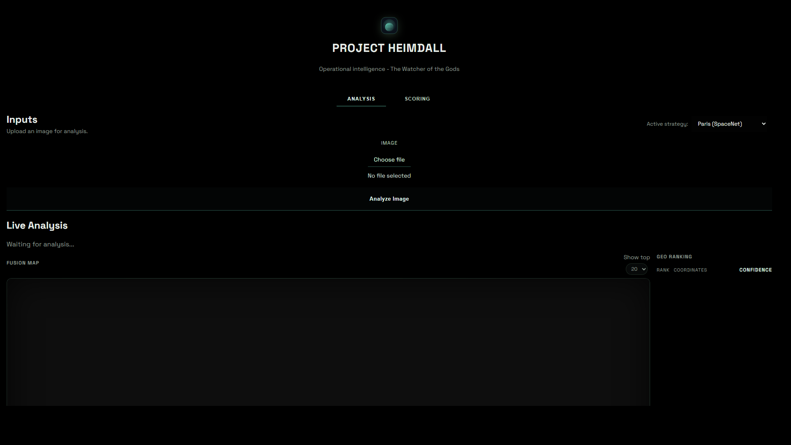

# Project Heimdall

[](#requirements)
[](#requirements)
[](LICENSE)

Geospatial perception and analysis platform that combines object detection, geo-candidate retrieval, probabilistic fusion, and operator-facing explainability.

## What The Platform Does

Project Heimdall processes image or video inputs and produces:

- Object detections (including oriented bounding boxes for aerial imagery)
- Ranked geolocation candidates
- Fused geolocation estimate with uncertainty metrics
- Operator-friendly analysis views in a local dashboard

## Project Scope

This repository implements the perception, geolocation, fusion, explainability,
and evaluation layers of Project Heimdall.

Current scope includes:

- Detection and oriented bounding-box localization
- Multi-provider geolocation candidate generation
- Probabilistic fusion and uncertainty estimation
- Explainable structured outputs for analysis and audits
- Local dashboard and API workflows for evaluation

Current non-goals include:

- Production deployment and operational decision automation
- Scraping pipelines and broad ingestion connectors
- Text/LLM reasoning as a dependency in core inference

## Demo

### Analysis App Video (Desktop)

[](docs/images/analysis-demo.webm)

GitHub does not render embedded `<video>` tags in README reliably, so use the preview image above to open the video.
Direct link: [Watch/download demo video](docs/images/analysis-demo.webm)

To regenerate this demo automatically:

```powershell
.\.venv\Scripts\python -m pip install playwright
.\.venv\Scripts\python -m playwright install chromium
.\.venv\Scripts\python -m src.tools.record_demo_video
```

Optional (include Analyze Image run if model deps are healthy):

```powershell
.\.venv\Scripts\python -m src.tools.record_demo_video --with-analyze
```

### Demo Recording Checklist (for replacement video)

Record the new demo while showing these interactions:

1. Launch app with `.\.venv\Scripts\python -m src.tools.dev_app`.
2. Open the printed `/analysis/` URL.
3. Keep recording clean (no error banners in UI).
4. In the 3D globe, drag to rotate/pan.
5. Use mouse wheel scroll to zoom in and zoom out on the globe.
6. Click map controls (`Zoom In`, `Zoom Out`, `Reset`) to show full interaction flow.
7. Keep final files at `docs/images/analysis-demo.webm` and `docs/images/analysis-desktop.png`.

## Architecture Overview

The platform is organized as a modular pipeline:

1. Detection: runs detector backends through a unified interface.
2. Geo candidate retrieval: proposes top-N location hypotheses.
3. Verification and fusion: combines retrieval + verification signals into posterior weights.
4. Scoring and serialization: emits structured outputs for CLI, batch runs, and UI.
5. Dashboard/API layer: serves analysis and evaluation workflows.

## Core Modules

- `src/core/detection`: detector interface and implementations (`ultralytics_obb`,
  sidecar/classic adapters, detector factory)
- `src/core/geo`: geolocation providers (`GeoSpot/GeoCLIP` style + retrieval index)
- `src/core/logic`: fusion, likelihoods, scoring, verification, serialization, pipeline
- `src/schemas`: structured payload contracts for detections, candidates, and fusion
- `src/tools`: data prep, indexing, calibration, evaluation, and reporting utilities
- `src/dashboard`: analysis UI, map visualization, and scoring flows

## Technology Stack

- Language: Python 3.10+
- API/UI server: FastAPI + Uvicorn
- Vision and detection: Ultralytics (YOLO OBB), OpenCV, Pillow
- Geolocation: GeoCLIP/GeoSpot-style providers + retrieval index pipeline
- Data tooling: NumPy, Rasterio, AWS CLI integrations
- Validation/testing: JSON Schema, pytest
- Frontend: Vanilla HTML/CSS/JS + MapLibre GL

## Technology and Models (Detailed)

- Detection runtime: Ultralytics OBB pipeline with default weights `yolo11x-obb.pt`.
- Detection config: `src/config/defaults.json` (`detector.*`).
- Geolocation runtime: `sdan/geospot-base` for geo candidate inference.
- Retrieval model support: CLIP-based retrieval index with default model
  `openai/clip-vit-large-patch14`.
- Geo and fusion config: `src/config/defaults.json` (`geolocator.*`, `fusion.*`).
- Fusion behavior: log-space posterior fusion over ranked geo candidates.
- Uncertainty outputs: radius and ellipse exposed in pipeline outputs/UI.
- API server: `src/tools/ui_server.py` (FastAPI).
- Analysis frontend: `src/dashboard/analysis/`.

## Repository Structure

```text
Project-Heimdall/
|- src/
|  |- core/          # Detection, geo, fusion, scoring logic
|  |- tools/         # Data prep, evaluation, utility scripts
|  |- dashboard/     # Analysis UI assets
|  |- schemas/       # Typed payload schemas
|  |- tests/         # Unit tests
|  |- config/        # Runtime config profiles
|  |- docs/          # Technical documentation
|  `- scripts/       # Helper shell scripts
|- data/             # Local datasets/models (not versioned)
|- runs/             # Evaluation outputs
|- docs/images/      # README screenshots
|- README.md
`- requirements.txt
```

## Requirements

- Python 3.10+
- Git
- Optional GPU acceleration: PyTorch installed for your CUDA target

Install project dependencies:

```powershell
python -m venv .venv
.\.venv\Scripts\Activate.ps1
pip install -r requirements.txt
```

For reproducible installs, use the lockfile:

```powershell
pip install -r requirements.lock.txt
```

Environment verification:

```powershell
.\.venv\Scripts\python -m src.tools.doctor
```

Clean rebuild + verify in one command (run from a non-venv Python interpreter):

```powershell
python -m src.tools.doctor --rebuild
```

Development app launch (auto-picks free port):

```powershell
.\.venv\Scripts\python -m src.tools.dev_app
```

This starts the full app server: API + dashboard + analysis UI.

If filesystem watcher issues occur, run without reload:

```powershell
.\.venv\Scripts\python -m src.tools.dev_app --no-reload
```

## Quick Start

### 1. Generate dashboard summary data

```powershell
.\.venv\Scripts\python -m src.tools.generate_ui_data --jsonl runs/results.jsonl
```

### 2. Start the app server

```powershell
.\.venv\Scripts\python -m src.tools.dev_app
```

### 3. Open the app

- Open the URL printed in your terminal (example: `http://127.0.0.1:8000/analysis/`).

## How To Use The App

1. Start the server:

```powershell
.\.venv\Scripts\python -m src.tools.dev_app
```

2. Open the `/analysis/` URL printed in terminal.
3. Select strategy profile.
4. Upload image and click `Analyze Image`.
5. Review detections, geo ranking, and fusion map.
6. Interact with 3D globe: drag to rotate/pan.
7. Scroll wheel to zoom in and zoom out.
8. Use `Zoom In`, `Zoom Out`, and `Reset` buttons.

## Common Workflows

### Run single-image inference (CLI)

```powershell
.\.venv\Scripts\python -m src.cli data/samples/real_port_miami.jpg --json
```

### Run batch inference

```powershell
.\.venv\Scripts\python -m src.batch_run data/university-1652/images/train --output runs/results.jsonl
```

### Rebuild dashboard payload from batch output

```powershell
.\.venv\Scripts\python -m src.tools.generate_ui_data --jsonl runs/results.jsonl
```

### Run test suite

```powershell
.\.venv\Scripts\python -m pytest -q
```

## Troubleshooting

If startup fails with `WinError 1392` under `.venv\Lib\site-packages\torch\...`, your venv is corrupted.
Recreate it from scratch:

```powershell
deactivate
rmdir /s /q .venv
python -m venv .venv
.\.venv\Scripts\Activate.ps1
python -m pip install --upgrade pip
pip install -r requirements.txt
```

Then reinstall your matching `torch/torchvision/torchaudio` build (CPU or CUDA) and rerun:

```powershell
.\.venv\Scripts\python -m src.tools.dev_app
```

## Config Profiles

Config files are under `src/config/`:

- `defaults.json`: default runtime profile
- `paris.json`: SpaceNet Paris-focused profile
- `paris_test.json`: Paris test profile
- `open_geo.json`: lightweight open-geo profile

Pass a config where supported with `--config <path>`.

## Data and Model Notes

- Large datasets and model artifacts are intentionally not stored in Git.
- Typical local path: `data/geo_index/*.npz`
- Typical local path: `data/models/*`
- Typical local path: `data/dota_v1/*`
- See [Geo Tech Notes](src/docs/GEO_TECH.md) for deeper implementation and dataset details.

## Engineering and Contribution

- Contribution guide: [CONTRIBUTING.md](CONTRIBUTING.md)
- Code of conduct: []()
- Security policy: []()
- Support: [SUPPORT.md](SUPPORT.md)
- Changelog: [CHANGELOG.md](CHANGELOG.md)
- Progress tracking: [PROGRESS.md](PROGRESS.md)
- Issue templates: [`.github/ISSUE_TEMPLATE`](.github/ISSUE_TEMPLATE)
- PR template: [`.github/pull_request_template.md`](.github/pull_request_template.md)
- Dependency updates: [`.github/dependabot.yml`](.github/dependabot.yml)

## License

This project is released under the MIT License. See [LICENSE](LICENSE).
